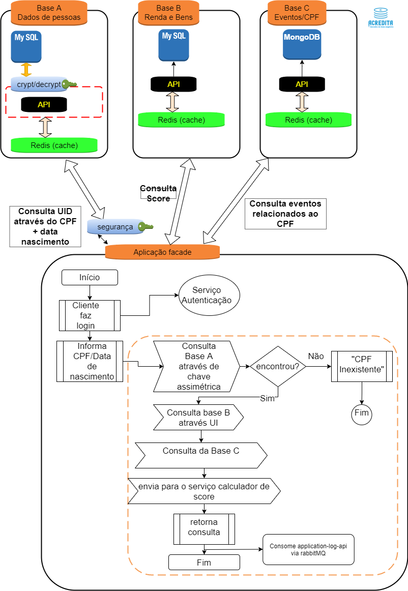

# aCredita - portal para pesquisa do score de CPF

---

## Objetivo
O projeto tem como objetivo, uma vez que informado um CPF e Data de nascimento trazer o score deste CPF. Para tal contamos com 3 bases (serviços):  

Essas 3 bases, são 3 API-s desenvolvidas por terceiros e para representá-las utilizei o [json-server](https://www.npmjs.com/package/json-server) com o seguinte [banco de dados](./docker/db.json)
**IMPORTANTE** : não desenvolvi essas 3 APIs, parti do princípio, pelo enunciado do exercício que já estavam de pé, e apenas supus a sua arquitetura. (2.2 - Tráfego - "...Vale salientar que essas bases de dados são externas, portanto não é
necessário dissertar sobre suas implementações, apenas suas consumações. ...")  
  

## São as 3 Bases :
Base A - **people** -  Dados das pessoas - contém dados pessoais, e de acordo com a lei  13.709/2018 (LGPD) deve ser protegidos contra vazemanto de informações.
Contém os campos: 
* CPF
* Nome 
* Endereco
* Data de nascimento
* Dividas
para tal, a API que persiste os dados no BD utilizou uma criptografia com chave simétrica em todos os dados. Isso foi feito utilizando a biblioteca java [javax.crypto](https://docs.oracle.com/javase/7/docs/api/javax/crypto/package-summary.html);

A prinícpio apenas as duas APIs devem conhecer essa chave:  
* a API que persiste os dados  
* a API que consome os dados
essa chave pode ser configurada via application.properties, via variáveis de ambiente. Embora, que para mudar essa chave, deverá ser feita uma conversão da base atual.

A [interface da classe encryptação](./customer-api/src/main/java/br/com/acredita/customer/utils/IEncryptDecrypt.java) foi utilizada no projeto  **customer-api**, tendo a seguinte [implementação](./customer-api/src/main/java/br/com/acredita/customer/utils/EncryptDecrypt.java). Foi desenvolvido, obedecendo o design pattern delegate,  para facilitar em um futuro a troca da implementação sem afetar a funcionalidade. Neste projeto, foi feito dessa forma, mas, em um projeto real, essa biblioteca deveria ser empacotada em uma dependência. Para tal eu constumo utilizar o [Apache Archiva](http://archiva.apache.org/)
 

Base B - **income-and-possessions**  (renda e bens) - é uma base que por si só é anonimizada, já que os dados que revelam as  pessoas que são possuidores dessa renda / bens estão na base **people** e encriptados.  
Contém os campos:
* idade (segui a definição projeto, porém, não colocaria pois já existe a data de nascimento no people-api)
* renda 
* lista de bens 
* fonte de renda
  

Base C - **events** - eventos relacionados a esse CPF
* Última consulta
* Lista das movimentações financeiras por instituição
* Última compra de cartão - data/hora - valor

	
## Diagrama do funcionamento 

---
## O que foi desenvolvido:

Foram desenvolvidas 4 APIs
* authorization-server - como o próprio nome diz é um [**authorization server**](./authorization-server) ou seja, mediante usuário/senha o cliente da __aCredita__ consegue receber um token que lhe permitirá acessar a api [**customer**](./customer-api), que é a principal API desenvolvida. (o fluxo utilizado no authorization server foi o [*resource owner password credential*](#ROPC))

a API customer-api por sua vez, acessa a **people-api**, desencripta os dados, busca de forma **assincrona** nas bases **income-and-possessions-api** e **events-api**, em posse dos dados dessas 3 APIs, consolida tudo em um DTO  e consome a API [**score-api**](./score-api) que faz que irá efeturar o calculo de score e retornar um numero de 0 - 100 representando o score da pessoa pesquisada. Após pesquisar o score a consulta é logada na [**application-log-api**](./application-log-api), para tal foi utilizado o sistema de messageria RabbitMQ

isso tudo pode ser visualizado melhor no diagrama abaixo :

# Quais as metodologias, arquitetura e design patterns utilizados:
* Cache de segundo nivel com redis - permite o cache de maneira distribuida tornando a aplicação muito rapida;
* Criação de interface para os services/controllers - possibilita no futuro fazer um decorator com facilidade, alem do desacoplamento.
* Desacoplar a classe de encriptação através de uma interface, permite de no futuro utilizar, se precisar trocar a implemtação fazer via delegate;
* Passar CPF e data de nascimento ao invés de passar apenas CPF - dificulta com posse de apenas o CPF conseguir fazer a pesquisa do score da pessoa
* Criação de uma api para calculo de score ao invés de utilizar isso em uma classe dentro da própria customer-api - possibilita, em produção, caso seja necessário trocar a forma de calcular, mudar apenas esse service;
* Criação de constantes para manter os path dos endpoints - permite a mudança sem necessidade de refactory no sistema todo
* Criação do pacote exceptions - centralizar todas as exceções possíveis da api
* Criação da classe ApiExcetionHandler - implementa a interface __ResponseEntityExceptionHandler__ o que permite "capturar" e tratar todas as exceções do sistema de maneira centralizada 
* Utilização de classes filter para busca de informações - facilita e padroniza as buscas facilitando em muito a vida do front
* No authorization-server-api foi utilizado um par de chaves publica/privada para garantir validar/assinar o token - utilizando para isso a ferramenta [keytool](https://docs.oracle.com/en/java/javase/12/tools/keytool.html) que vem com java 
* Dockerizar a aplicação - facilidade na montagem do ambiente, homogeneidade entre embiente de dev e prod;
* Utilização o ngInx para proxy reverso e fazer o [Poor man Load balance](https://www.networkworld.com/article/2722741/poor-man-s-load-balancing.html#:~:text=Poor%20man%27s%20load%20balancing%20is%20properly%20called%20Round,could%20set%20up%20five%20A%20records%20like%20this%3A), com isso a custome-api será sempre acessada na porta 80

# Para buildar os .Jar 
Para facilitar foi criado um script de [build](./build.sh)
basta executar ./build.sh

# Docker
	cd docker
	**para buildar as imagens e levantar os containers**
	docker-compose -f docker-compose-dev.yaml up -d --build 
	* lembrando que demora um pouco pra subir devido ao proxy reverso

	**para levantar os containers sem buildar as imagens**
	docker-compose -f docker-compose-dev.yaml up 

	**para baixar os containers **
	docker-compose -f docker-compose-dev.yaml down 

# Os paths após as APIs subirem 
	**RabbitMQ** --> http://localhost:15672/ --> userName: admin, password: admin
	**Redis-Commander** --> http://localhost:3000/
	**mySqlAdmin**  --> http://localhost:9090 -> userName: root, password: root
	**Jaeger tracing** --> http://localhost:16686

	**Authorization-server-api** --> http://localhost:8081/swagger-ui.html
	**score-api** --> http://localhost:8082/swagger-ui.html
	**customer-api** --> http://localhost/swagger-ui.html
	**Log-api** --> http://localhost:8089/swagger-ui.html

# A chave simétrica utilizada para encrypt/decrypt foi 'batatinha-frita1'

## PESSOAS VALIDAS PARA TESTES
    CPF - Dt. Nascim
		50400131080 - 1971-11-17  
		62331404046 - 1994-12-17  
		28709899030 - 2000-08-17  
		35211394097 - 1986-01-17  
		90115973036 - 1964-03-22  
		47693719008 - 1987-05-12  
		50904687023 - 1995-10-15  
		28518300070 - 1990-04-01  
		

